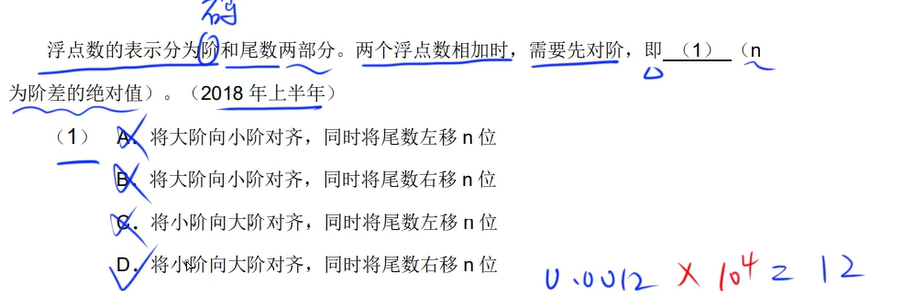
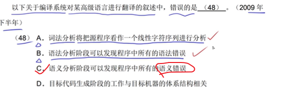
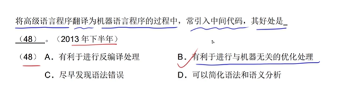
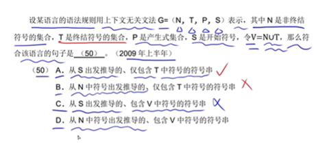
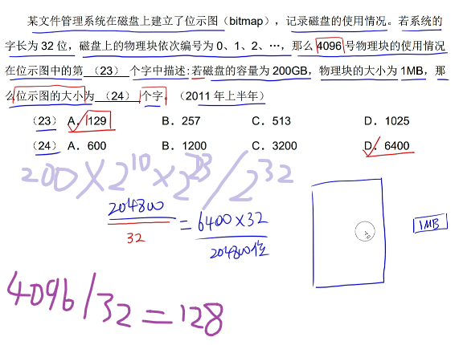

# 注意点

> 考试时间

```css
#上午 
09:00~11:30
#下午
14:00~16:30
```

# 考纲

> 上午题


> 下午题

1. 数据流
2. 数据库
3. UML
4. 算法
5. 面向对象编程


# 上午题

## 1.计算机系统

> cpu


> 存储器


> 数据表示




> 寻址


> 校验码


```css
#码距不能=1

#检错
>=2

#纠错
>=3

#一位校验中
关键词: 奇数个数据位
```


> RISC CISC


> 流水线


> 存储器


> cache


> 中断


C


> 总线


> 加密


对称秘钥 = 私钥 + 共享

​	DES RC AES

非对称秘钥 = 公钥

​	RSA

其他

​	md5 摘要算法 128位	


> 可靠性


选D


> 其他

1. pc 程序计数器 可访问
2. 指令字长
3. 双符号位 异或
4. 主动攻击
   1. 重放
   2. IP地址欺骗
   3. 拒绝服务
   4. 系统干涉
   5. 修改数据命令
5. 被动攻击
   1. 流量分析
   2. 会话拦截

## 5.程序设计语言

> 编译

1. 解释器：翻译程序，不生成目标程序
2. 编译器：有目标程序


> 基本控制结构

1. 顺序
2. 选择
3. 重复


> 变量与常量


> 引用


> 编译与解释


关键词：

1. 编译 不可省略 完全独立 目标代码
2. 解释 参与控制 速度慢

> 符号表


> 词法分析




> 中间代码





> 正规式


> 有限自动机


> 上下文无关




> 中后缀表达式


> 杂题


## 6.操作系统

> 系统软件


应用软件（最终用户）：

1. 财务软件
2. 汽车防盗软件

系统软件（应用软件开发者）:

1. 编译程序
2. 汇编程序
3. java解释器
4. 语言处理程序
5. 数据库管理系统

> 前驱图--PV操作


> 前驱图--并发执行


> 进程状态


> 同步互斥


> 死锁


> 进程资源图


出箭头表示`申请资源`

入箭头表示`已分配的资源`

有一个进程可以运行，就是可以化简的

> 线程


多线程可共享

1. 代码段
2. 资源
3. 全局变量

> 局部性原理


> 分页式


> 段页式


关键词：`最大允许`

> 单双缓冲区


> 磁盘调度算法


scan	扫描是 → 再 ← 

c-scan  是    -> 再到左边的尽头 --> 

> 磁道调度

不要了

> 文件管理


> 目录结构


> 位示图



位示图大小= （容量*1024/物理块大小）/ 32


# 下午题

